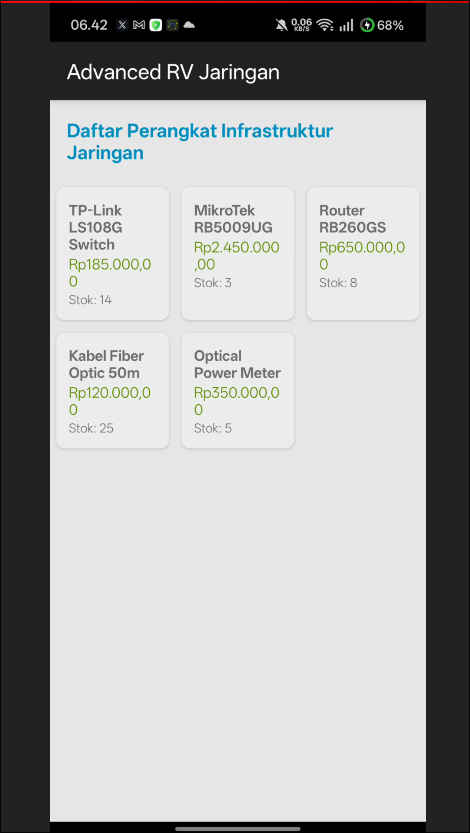

# Tugas 10: Advanced RecyclerView Use Cases

## Identitas Lengkap
* **Nama:** Muhammad Dafi Al Haq
* **NIM:** 452024611067  

## Dokumentasi Tampilan Aplikasi
Berikut adalah dokumentasi visual running aplikasi yang menunjukkan implementasi daftar berbentuk Grid (3 kolom), pemisahan Multiple View Type antara komponen komponen Header dan Item Data Perangkat Jaringan, serta penerapan kustom format mata uang Rupiah langsung dari XML:

---

## Analisis Efisiensi Komputasi: Standard RecyclerView.Adapter vs ListAdapter

Berdasarkan materi akademik pada *Lesson 10: Advanced RecyclerView Use Cases*, berikut adalah analisis perbedaan efisiensi aksi manipulasi data antara kedua jenis adapter:

1. **Mekanisme Pembaruan Data:**
   * **Standard RecyclerView.Adapter:** Memiliki kelemahan struktural di mana sistem akan membuang total data UI lama pada setiap kali terjadi pembaruan daftar (*disposes UI data on every update*). Proses perombakan menyeluruh ini memakan waktu komputasi yang tinggi dan tidak efisien (*costly and wasteful*).
   * **ListAdapter:** Mengadopsi pendekatan modern yang secara cerdas menghitung perbedaan presisi antara apa yang saat ini sedang ditampilkan di layar dengan apa yang perlu ditampilkan pada list data baru (*computes the difference between what is currently shown and what needs to be shown*). Seluruh kalkulasi perubahan tersebut dieksekusi di *background thread* sehingga *UI thread* utama tidak terhambat.

2. **Perbandingan Jumlah Tindakan Kalkulasi (Studi Kasus Sorting):**
   * Ketika melakukan manipulasi berupa pengurutan data (*sorting*), perbedaan jumlah tindakan yang dieksekusi oleh kedua sistem sangat signifikan:
     * **Standard Adapter:** Memerlukan total **16 tindakan** komputasi yang terbagi atas 8 aksi penghapusan (*deletions*) dan 8 aksi penyisipan (*insertions*).
     * **ListAdapter:** Berkat pemanfaatan komponen `DiffUtil.ItemCallback`, sistem hanya memerlukan total **6 tindakan** komputasi saja yang terbagi atas 3 aksi penyisipan (*insertions*) dan 3 aksi penghapusan (*deletions*).
   * Penghematan ini terjadi karena fungsi callback `areItemsTheSame` dan `areContentsTheSame` memproses verifikasi item secara mendalam untuk menentukan transformasi paling minimum yang diperlukan. Hasilnya, konsumsi CPU menjadi jauh lebih rendah dan proses pembaruan data berjalan dengan tingkat kelancaran yang sangat tinggi (*smooth transition*).
