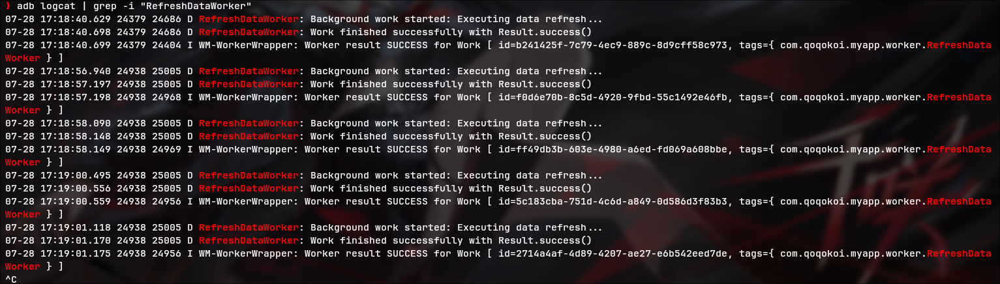
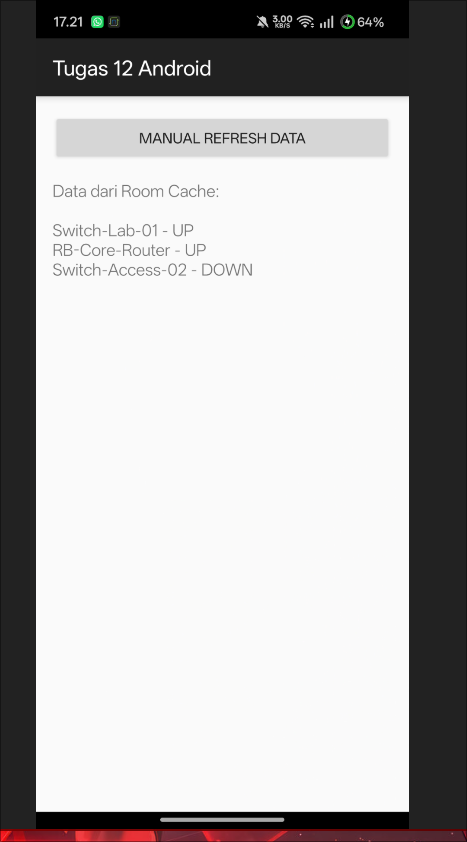

# Tugas 12: Repository Pattern & WorkManager

## Identitas Lengkap
* **Nama**: Muhammad Dafi Al Haq
* **NIM**: 452024611067

## Dokumentasi Visual & Bukti Eksekusi

### 1. Bukti Logcat Execution (Result.success())

### 2. Tampilan Aplikasi (Local Room Data Caching)

---

## Ulasan Arsitektur: Keuntungan Repository Pattern

Penggunaan **Repository Pattern** memberikan abstraksi penuh pada layer data sehingga `ViewModel` tidak perlu mengetahui dari mana data berasal (apakah dari database SQLite lokal/Room atau remote REST API). Repositori bertindak sebagai *Single Source of Truth* yang mengelola sinkronisasi data secara terpusat, sehingga arsitektur kode menjadi lebih rapi, terstruktur, dan memenuhi prinsip *Separation of Concerns*.

Dikombinasikan dengan **WorkManager**, aplikasi dapat mengimplementasikan strategi *Offline-First* secara optimal. Saat terjadi gangguan koneksi atau server bermasalah, aplikasi tetap dapat menyajikan data dari *cache* lokal Room tanpa memicu *crash*. Sementara itu, tugas *refresh* data di latar belakang dapat dijadwalkan secara terjamin (*guaranteed execution*) dan efisien berdasarkan batasan (*constraints*) perangkat, seperti status pengisian daya dan koneksi Wi-Fi.
