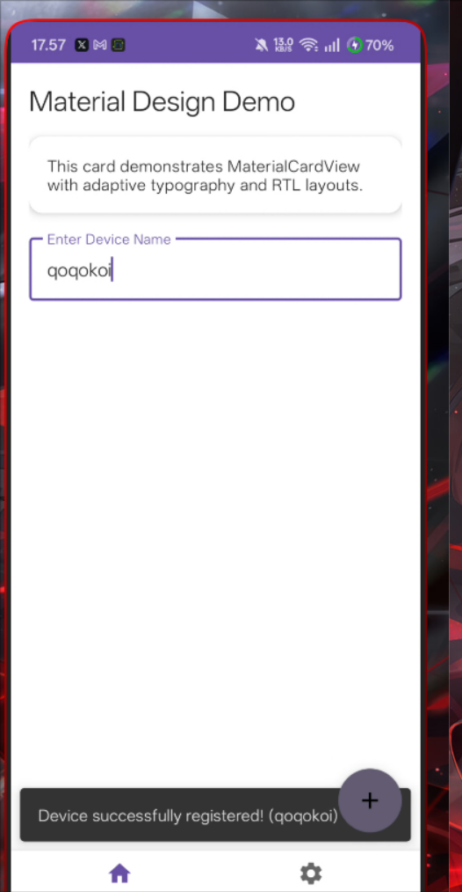
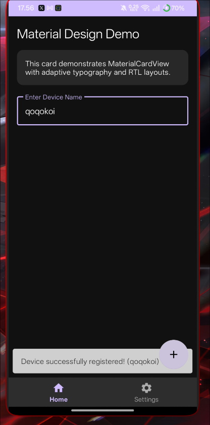
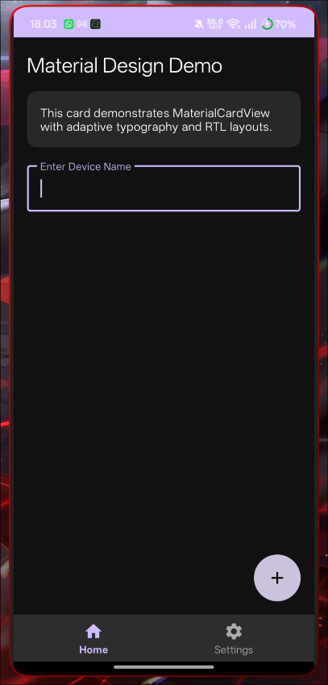
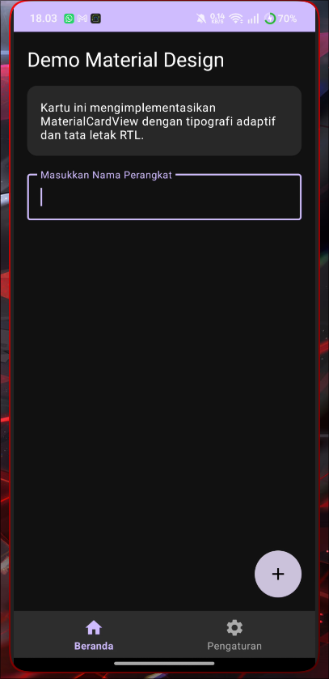

# Tugas 13: App UI Design, Material Components & Localization

## Identitas Mahasiswa
* **Nama**: Muhammad Dafi Al Haq
* **NIM**: 452024611067
* **Nama Repository**: Tugas13_Android_UI_Design_452024611067

---

## Bukti Eksekusi Visual

### 1. Light Mode vs Dark Mode
| Light Mode | Dark Mode |
| :---: | :---: |
|  |  |

### 2. Localization (English vs Bahasa Indonesia) & RTL Support
| English (Default) | Bahasa Indonesia (`values-in`) |
| :---: | :---: |
|  |  |

---

## Urutan Tingkat Prioritas (Precedence) Android Styling System

Dalam sistem dekorasi antarmuka Android, urutan tingkat prioritas (*precedence*) dari yang paling dominan hingga paling dasar adalah **View Attributes > Style > Theme**. Atribut yang dideklarasikan secara eksplisit langsung pada elemen XML dalam layout (*View Attributes*, seperti `android:textColor="#FF0000"`) memiliki prioritas tertinggi dan akan selalu mengabaikan (*override*) nilai yang diatur dalam file *Style* maupun *Theme*. Selapis di bawahnya, nilai yang dikelompokkan ke dalam sebuah *Style* (dipanggil via `style="@style/..."`) akan mengabaikan nilai standar dari *Theme*. Atribut *Theme* yang didefinisikan di tingkat aplikasi/aktivitas memiliki prioritas terendah dan berfungsi sebagai nilai bawaan (*fallback default*) global jika tidak ada aturan khusus pada level *Style* maupun *View*.
